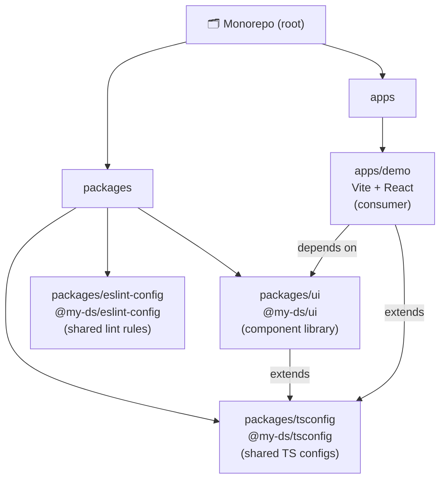
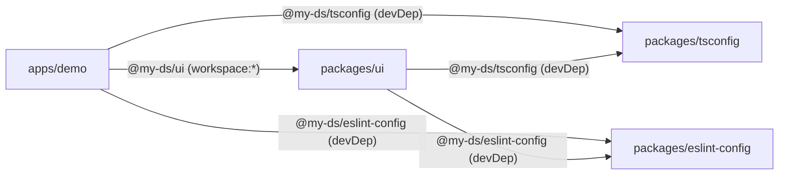
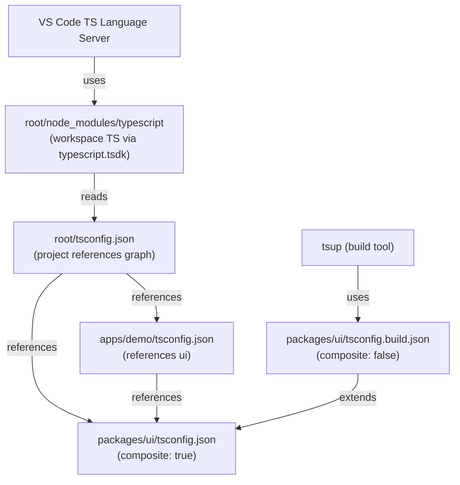
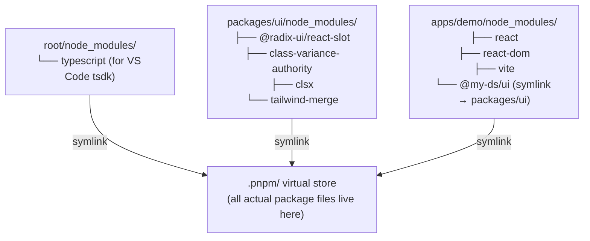
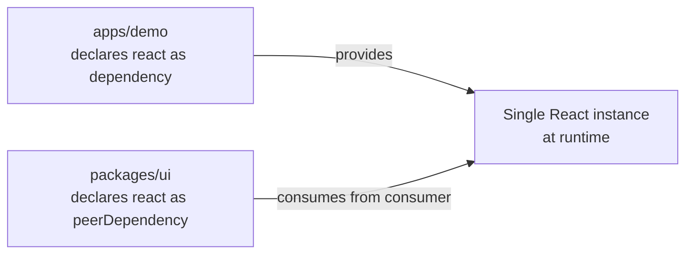

# Monorepo Architecture

## Workspace Structure

---

## Package Dependency Graph

---

## TypeScript Resolution

---

## pnpm node_modules Layout

> **Isolation rule:** pnpm only creates a symlink in a package's `node_modules` if that package explicitly declares the dependency. Undeclared packages are inaccessible even though they physically exist in `.pnpm/`.

---

## React Instance Flow

