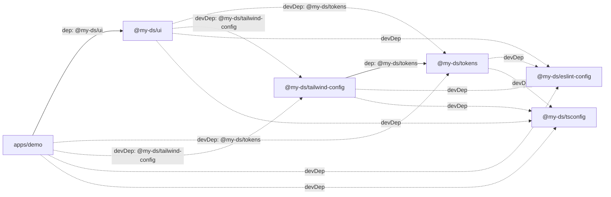

# Monorepo Architecture

## Workspace Structure

```
Monorepo/
├── apps/
│   └── demo/                   # Vite + React consumer app
├── packages/
│   ├── tokens/                 # @my-ds/tokens — design token values + types
│   ├── tailwind-config/        # @my-ds/tailwind-config — createPreset() factory
│   ├── ui/                     # @my-ds/ui — React component library
│   ├── eslint-config/          # @my-ds/eslint-config — shared lint rules
│   └── tsconfig/               # @my-ds/tsconfig — shared TS configs
├── .github/workflows/          # CI (build + lint on every PR/push to main)
├── .npmrc                      # pnpm config + @my-ds registry
├── turbo.json                  # Turbo task pipeline
└── pnpm-workspace.yaml         # Workspace package globs
```

---

## Package Dependency Graph



> Solid lines = runtime `dependencies`. Dashed = `devDependencies`.

---

## What Each Package Resolves At Build vs Runtime

### `@my-ds/tokens`

| Phase | Resolved modules |
|-------|-----------------|
| **Build (tsup)** | `tsup`, `typescript`, `@my-ds/tsconfig`, `@my-ds/eslint-config` |
| **Runtime (dist/index.js)** | Nothing — pure ESM module exporting plain JS objects and TS types |

No external dependencies at runtime. `dist/index.js` is 627B of self-contained JS.

---

### `@my-ds/tailwind-config`

| Phase | Resolved modules |
|-------|-----------------|
| **Build (tsup)** | `tsup`, `typescript`, `tailwindcss` (devDep), `@my-ds/tokens` (resolves to its dist), `@my-ds/tsconfig` |
| **Runtime (dist/index.js)** | `tailwindcss-animate` (bundled dep), `@my-ds/tokens` (direct dep — resolved from consumer's node_modules at the time `createPreset()` is called) |
| **`tailwindcss` itself** | Peer dep — NOT bundled, provided by whoever calls the preset (demo, ui) |

`createPreset()` is a factory called at **Tailwind config evaluation time** (Node.js, PostCSS pipeline), not in the browser.

---

### `@my-ds/ui`

| Phase | Resolved modules |
|-------|-----------------|
| **Build (tsup)** | `tsup`, `typescript`, `@types/react`, `@types/react-dom`, `@my-ds/tsconfig`, `@my-ds/eslint-config` |
| **Bundled into dist/** | `@radix-ui/react-avatar`, `@radix-ui/react-slot`, `class-variance-authority`, `clsx`, `tailwind-merge` |
| **NOT bundled (external)** | `react`, `react-dom` — peer deps, expected from the consumer app |
| **Runtime in browser** | The bundled deps above + `react`/`react-dom` from the host app |

Storybook devDeps (`@storybook/*`, `tailwindcss`, `autoprefixer`, `postcss`) are **dev-only**, never in dist.

---

### `apps/demo`

| Phase | Resolved modules |
|-------|-----------------|
| **Build (Vite + tsc)** | `vite`, `@vitejs/plugin-react`, `typescript`, `tailwindcss`, `autoprefixer`, `postcss`, `@my-ds/tailwind-config`, `@my-ds/tokens`, `@my-ds/tsconfig` |
| **Tailwind config eval (Node.js)** | `@my-ds/tailwind-config` dist → calls `createPreset()` → imports `@my-ds/tokens` dist |
| **Runtime in browser** | `react`, `react-dom`, `@my-ds/ui` dist (which includes Radix + CVA + clsx + tailwind-merge) |

---

## pnpm Isolated Node Modules

pnpm (default isolated linker) only creates a symlink in a package's `node_modules/` if that package **explicitly declares** the dependency. Nothing leaks across packages.

```
node_modules/                          ← root: turbo, prettier, typescript, @changesets/cli
  .pnpm/                               ← virtual store: all actual package files live here
    @my-ds+tokens@0.0.0/
    @my-ds+tailwind-config@0.0.0/
    @my-ds+ui@0.0.0/
    react@18.x/
    tailwindcss@3.x/
    tsup@8.x/
    ... (every dep, deduplicated)

packages/tokens/node_modules/
  @my-ds/eslint-config → symlink to .pnpm
  @my-ds/tsconfig      → symlink to .pnpm
  tsup                 → symlink to .pnpm
  typescript           → symlink to .pnpm

packages/tailwind-config/node_modules/
  @my-ds/tokens        → symlink to packages/tokens (workspace)
  @my-ds/eslint-config → symlink to .pnpm
  @my-ds/tsconfig      → symlink to .pnpm
  tailwindcss          → symlink to .pnpm
  tailwindcss-animate  → symlink to .pnpm
  tsup                 → symlink to .pnpm
  typescript           → symlink to .pnpm

packages/ui/node_modules/
  @radix-ui/react-avatar → symlink to .pnpm
  @radix-ui/react-slot   → symlink to .pnpm
  class-variance-authority → symlink to .pnpm
  clsx                   → symlink to .pnpm
  tailwind-merge         → symlink to .pnpm
  react (peer)           → NOT here — provided by consumer
  react-dom (peer)       → NOT here — provided by consumer
  @my-ds/tailwind-config → symlink to packages/tailwind-config (devDep, for Storybook)
  @my-ds/tokens          → symlink to packages/tokens (devDep, for Storybook)
  @storybook/*           → symlinks to .pnpm (devDeps, Phase 3)
  tailwindcss            → symlink to .pnpm (devDep, for Storybook)

apps/demo/node_modules/
  react                  → symlink to .pnpm (provides React for itself AND @my-ds/ui peer dep)
  react-dom              → symlink to .pnpm
  @my-ds/ui              → symlink to packages/ui (workspace)
  @my-ds/tokens          → symlink to packages/tokens (devDep, for tailwind config)
  @my-ds/tailwind-config → symlink to packages/tailwind-config (devDep, for tailwind config)
  vite                   → symlink to .pnpm
  tailwindcss            → symlink to .pnpm
```

---

## TypeScript Config Inheritance

```
packages/tsconfig/base.json           ← strict ES2020, types:[], no lib
packages/tsconfig/react.json          ← extends base + jsx:react-jsx + lib:[DOM]
    ↑                  ↑
packages/tokens/       packages/tailwind-config/
packages/ui/           (extends react.json)
apps/demo/
```

### Why `"types": []` in `base.json`

TypeScript automatically discovers and includes ALL `@types/*` packages it finds in `node_modules/@types/`. With pnpm's isolated linker, transitive `@types` packages from devTools (e.g. `@types/minimatch` from `tsup → glob → minimatch`) can leak into the type program and fail to resolve correctly since they're not direct deps.

`"types": []` tells TypeScript: **only include `@types` packages I explicitly import or configure — discover nothing automatically.**

This is NOT a workaround. It is the [TypeScript-recommended](https://www.typescriptlang.org/tsconfig#types) way to prevent ambient type pollution from tooling.

**Important:** This does NOT affect:
- `import React from 'react'` → `@types/react` is found via normal module resolution
- JSX types → provided through `jsx: "react-jsx"` + `@types/react/jsx-runtime`
- DOM types → provided via `"lib": ["DOM", "DOM.Iterable"]` (TypeScript built-ins, not `@types/*`)

---

## ESM-Only Output

All three packages output **ESM only**:

```json
{ "type": "module", "exports": { ".": { "import": "./dist/index.js" } } }
```

tsup config: `format: ['esm']` → outputs `dist/index.js` (not `.mjs`, not `.cjs`).

No CJS output. Consumers must be ESM-compatible (Vite, Node 18+, modern bundlers).

---

## Build Pipeline (Turbo)

```
turbo build
  ├── @my-ds/tokens:build         (no deps — runs first)
  ├── @my-ds/tailwind-config:build (waits for tokens)
  ├── @my-ds/ui:build              (waits for tailwind-config)
  └── demo:build                  (waits for ui)

turbo dev (persistent)
  ├── @my-ds/tokens:dev           → tsup --watch
  ├── @my-ds/tailwind-config:dev  → tsup --watch
  ├── @my-ds/ui:dev               → tsup --watch
  └── demo:dev                    → vite

turbo lint (parallel, no deps)
  ├── @my-ds/tokens:lint
  ├── @my-ds/tailwind-config:lint
  ├── @my-ds/ui:lint
  └── demo:lint
```

Turbo caches `dist/**` outputs. If source unchanged, subsequent builds are instant (cache hit).

---

## CI Pipeline (GitHub Actions)

Triggers on: push or PR to `main`.

```
pnpm install --frozen-lockfile
  → pnpm build   (turbo build — all 4 packages in dependency order)
  → pnpm lint    (turbo lint — all 4 packages in parallel)
```

Fails fast if any package build or lint fails. PR cannot merge with a broken build.

---

## Token → CSS Flow

```
packages/tokens/src/index.ts         (source: plain JS color/radius values)
  ↓ tsup build
packages/tokens/dist/index.js        (ESM: exports { colors, radius, ColorTokens, RadiusTokens })
  ↓ imported by tailwind.config.js
packages/tailwind-config/dist/index.js  (createPreset factory)
  ↓ called by app's tailwind.config.js
apps/demo/tailwind.config.js          (presets: [createPreset({ colors, radius })])
  ↓ PostCSS + Tailwind processes src/**
apps/demo/src/index.css               (@tailwind base/components/utilities)
  ↓ Vite transforms
dist/assets/index-*.css               (generated utility classes e.g. bg-primary, text-secondary)
```

Token values are **baked into CSS at build time**. Changing a token requires a CSS rebuild (no HMR for CSS token changes — see Phase 3a: CSS Variables for the fix).
