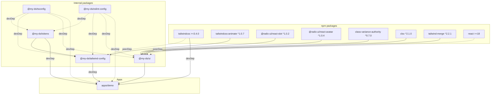
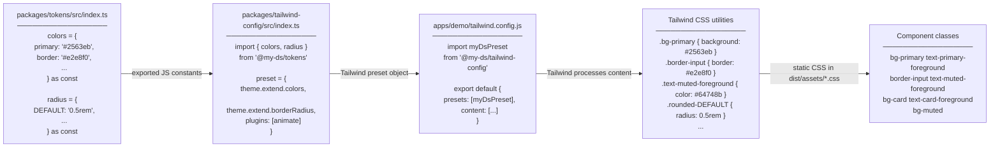
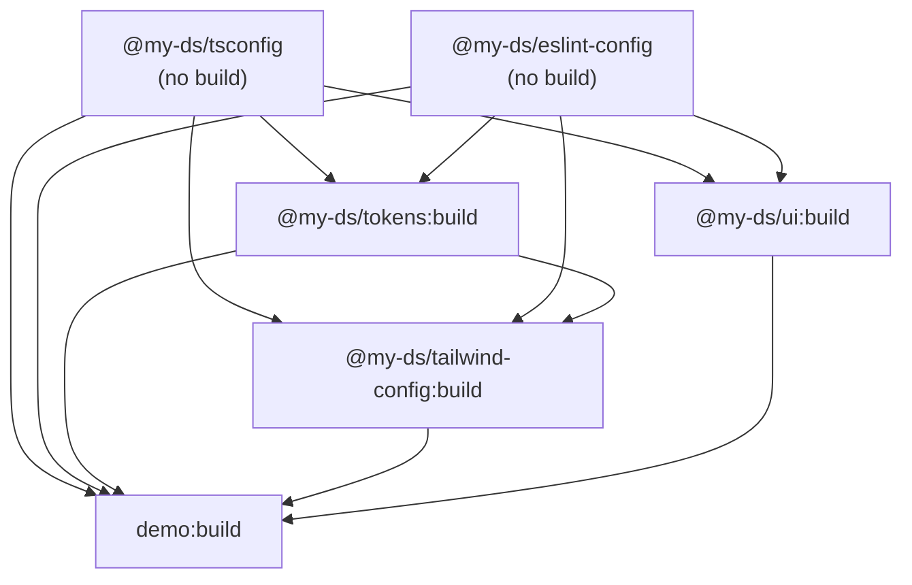
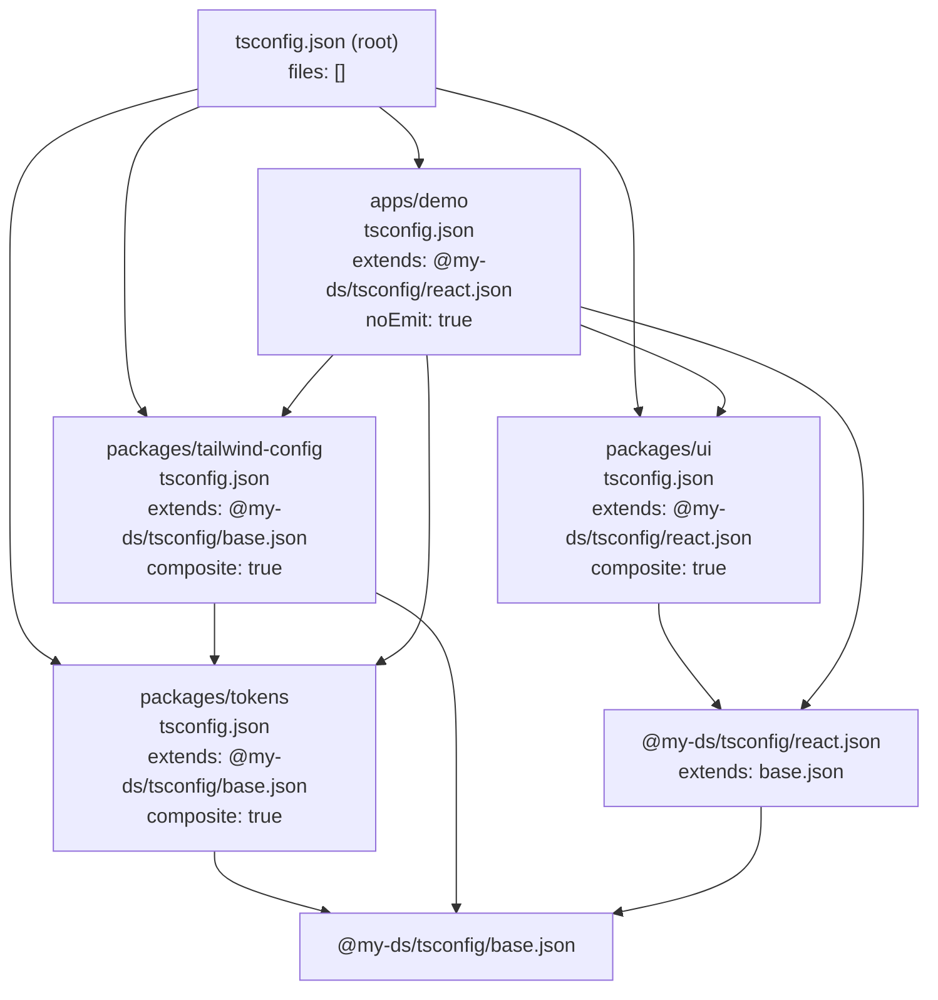

# Phase 2 — Design Tokens + Tailwind Config + New Components

## 1. Package Dependency Graph

## 2. Token → JS → Tailwind Data Flow

## 3. Turbo Build DAG

## 4. TypeScript Project Reference Graph

## 5. packages/ui Component Tree

```mermaid
graph TD
  ui_index["@my-ds/ui (src/index.ts)"]

  button["Button\n──────\nCVA variants:\n• default\n• destructive\n• outline\n• secondary\n• ghost\n• link\n\nSizes: sm, default, lg, icon\nDeps: @radix-ui/react-slot, cva"]

  badge["Badge\n──────\nCVA variants:\n• default\n• secondary\n• destructive\n• outline\n\nDeps: cva"]

  input["Input\n──────\nforwardRef wrapper\naround <input>\nStyling: border-input,\nfocus-visible:ring-ring,\nplaceholder:text-muted-foreground"]

  card["Card family\n──────\n• Card (root)\n• CardHeader\n• CardTitle\n• CardDescription\n  (text-muted-foreground)\n• CardContent\n• CardFooter"]

  avatar["Avatar family\n──────\n• Avatar (Root)\n• AvatarImage\n• AvatarFallback\n  (bg-muted)\n\nDeps: @radix-ui/react-avatar"]

  utils["lib/utils (cn)\n──────\nclsx + tailwind-merge"]

  ui_index --> button
  ui_index --> badge
  ui_index --> input
  ui_index --> card
  ui_index --> avatar
  ui_index --> utils

  button --> utils
  badge --> utils
  input --> utils
  card --> utils
  avatar --> utils
```

