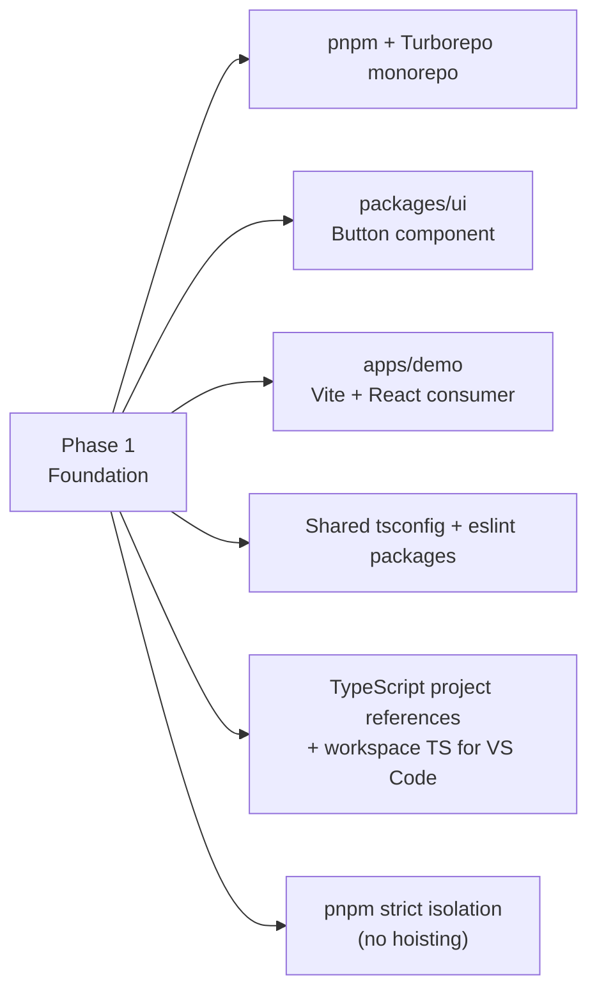
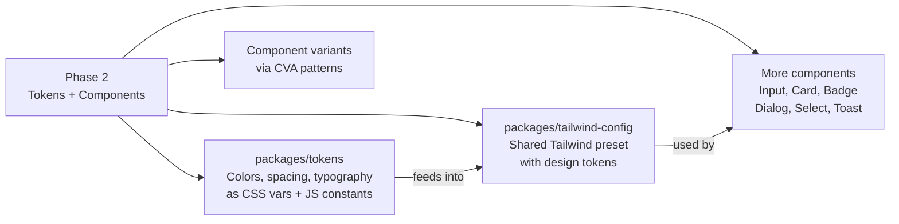
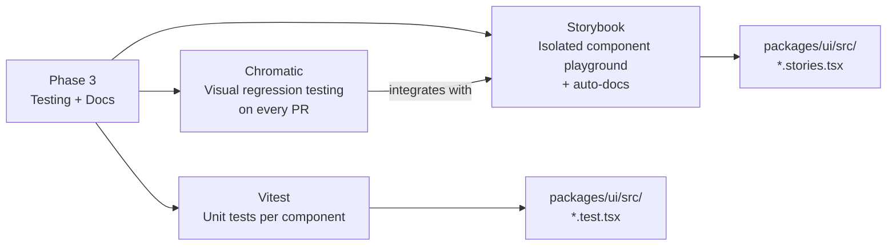
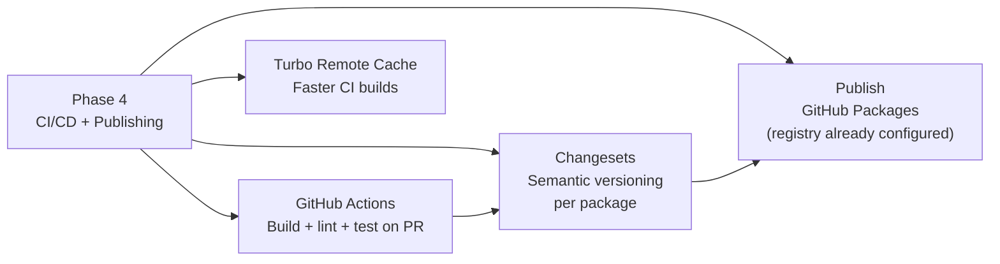
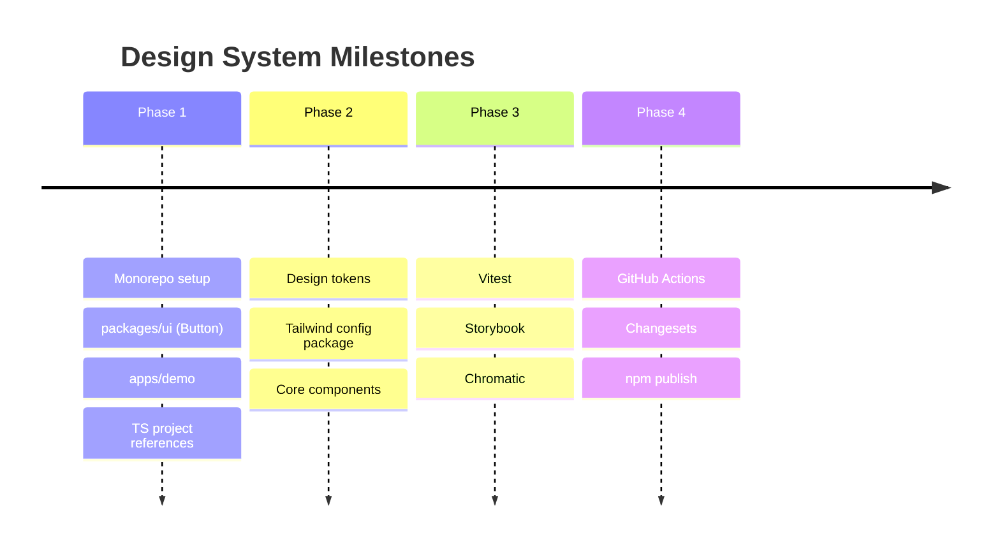

# Roadmap

## Phase 1 — Foundation ✅

---

## Phase 2 — Design Tokens + More Components

---

## Phase 3 — Testing + Documentation

---

## Phase 4 — CI/CD + Publishing

---

## Full Phase Overview

